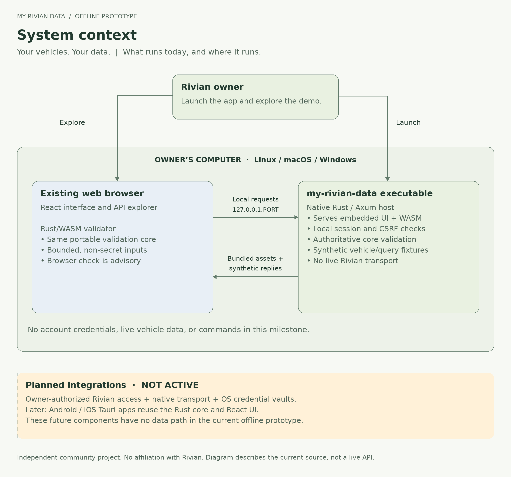
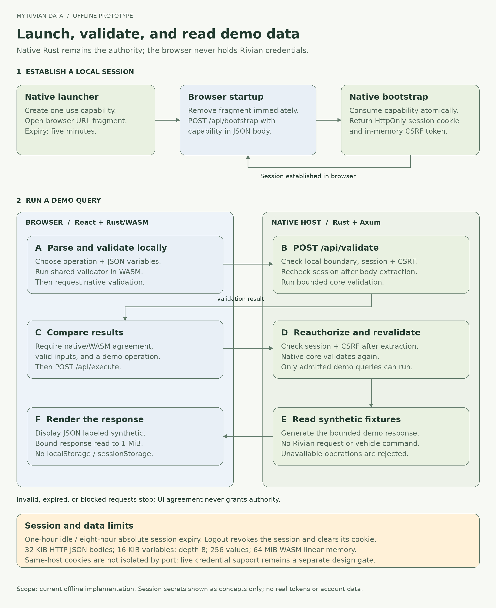

# Phase 1 foundation

My Rivian Data aims to give Rivian owners easy access to data associated with their
vehicles. This is milestone 0 of the selected native Rust/Axum + React/Rust-WASM plan.
It is an offline, credential-free prototype. Its six queries return synthetic
fixtures. The catalog's subscriptions and mutations cannot execute.

## System context

The current app and its data stay on the owner's computer. Planned Rivian account
access and Tauri mobile apps are shown separately from the working offline system.

## Source boundaries

| Component | Responsibility |
| --- | --- |
| `rivian-core` | Local operation catalog, normalized synthetic telemetry, bounded validation and read-only demo execution. No I/O or credentials. |
| `rivian-wasm` | JSON bindings around the same core validator. Browser validation is advisory; Rust revalidates every execution. |
| `rivian-host` | IPv4 loopback listener, embedded UI/WASM, launcher, local session and CSRF enforcement, typed demo endpoints. |
| `ui` | React views, operation explorer, native/WASM comparison and bounded response rendering. No persistent browser storage. |
| `fixtures` | Deterministic validation cases shared by native and actual compiled-WASM tests. |

The host embeds `ui/dist` in release builds. Node, Vite, Cargo and wasm-bindgen
are build tools; the executable does not launch them. It uses an existing browser.
The core and UI are structured for a later Tauri host adapter. No Axum server is
intended to run on a phone.

## Local HTTP contract

All requests require the exact `127.0.0.1:PORT` Host. A supplied Origin must match
the application's exact HTTP origin, and unsafe methods require that Origin.
Cross-site and same-site fetch metadata are rejected; there is no CORS allowlist.

| Route | Method | Access | Result |
| --- | --- | --- | --- |
| `/api/health` | GET | Exact local origin boundary | Build version and demo status only |
| `/api/bootstrap` | POST | Single-use launcher capability | HttpOnly local cookie and CSRF token |
| `/api/session` | GET | Local session | CSRF token and remaining absolute lifetime |
| `/api/catalog` | GET | Local session | Representative operation definitions |
| `/api/vehicles` | GET | Local session | Two explicitly synthetic vehicles |
| `/api/validate` | POST | Session + CSRF | Bounded native validation |
| `/api/execute` | POST | Session + CSRF | Revalidated, read-only synthetic query result |
| `/api/logout` | POST | Session + CSRF | Session revoked, cookie expired |

There are no endpoints for credentials, arbitrary URLs, shell commands, generic
GraphQL, signing, filesystem access or raw token retrieval. App operation IDs are
local identifiers, not verified upstream Rivian GraphQL operation names.

## Session sequence

The launcher creates a random 256-bit capability with a five-minute lifetime and
opens the browser with it in a URL fragment. The UI removes the fragment before
rendering, then sends the capability in a same-origin POST. A mutex makes bootstrap
consumption atomic. The returned cookie is HttpOnly and SameSite=Strict; the CSRF
token stays in JavaScript memory. Reload uses the local cookie to obtain a fresh
copy of the session's CSRF token. Logout or process exit requires a new launch.

The diagram's query path follows the current React adapter and native handlers.
Standalone PNGs and editable rendering sources are in [diagrams](diagrams/README.md).

Sessions expire after one idle hour or eight absolute hours. POST handlers check
session validity again after body extraction, preventing a delayed request admitted
before logout from executing afterward. Future network operations must reauthorize
at their actual dispatch point too.

The prototype uses HTTP strictly on loopback. Cookies have no port isolation;
another same-user service on `127.0.0.1` or a compromised browser/OS can undermine
this boundary. Random cookie names avoid collisions, not that threat. Resolve the
live-mode local-service trust policy before adding real credentials or commands.

The default launcher does not print the secret. `--print-launch-url` is a deliberate
manual/headless escape hatch: its output is a temporary credential. Do not redirect
it into logs, screenshots, bug reports or shared transcripts.

## Bounds and defense in depth

- HTTP JSON request bodies: 32 KiB. Variable JSON: 16 KiB, depth 8, at most 256 values.
- WASM linear memory: linker maximum 64 MiB, tested by attempting excess growth.
- Browser response reader: 1 MiB; requests abort after 12 seconds.
- Exact operation and variable admission, fixed demo account/vehicle IDs, bounded
  range checks and no mutation execution.
- CSP permits bundled scripts and narrow WASM evaluation only; no remote code,
  unsafe HTML insertion or general `unsafe-eval`.
- Responses include `no-store`, `nosniff`, no-referrer, frame prevention and
  cross-origin resource/opener isolation headers.
- Static path aliases, traversal and dotfiles are rejected before asset lookup,
  including when rust-embed reads source assets in a debug build.

The UI's parity indicator does not authorize execution. Native validation always
remains the authority. Synthetic fixture times are deliberately fixed and labeled;
they are never represented as current vehicle status.

## Next integration milestones

1. Admit the full known operation inventory with source/version, exact upstream
   documents, capability prerequisites, test status and sanitized fixtures.
2. Implement native Rivian transport with reviewed destinations, verified TLS,
   timeouts, bounded replies, GraphQL error handling and rate-aware retries.
3. Implement username/email, password and MFA state machines behind mock transport
   tests; add desktop OS vault adapters before allowing remembered sessions.
4. Prove real read-only account/vehicle requests with user-supplied access through
   the local app, then authenticated WebSocket/Parallax telemetry.
5. Prove authorized enrollment and signing before selectively enabling commands;
   never retry an ambiguous command blindly or copy another phone's secrets.
6. Complete Windows/macOS/Linux clean-install, update, signing and compatibility
   checks. Produce consumer installers after the native transport/security gates.
7. Complete independent Anthropic review and remediation before release. Build
   Tauri mobile shells only after the phase-1 release milestone; early compile/vault
   feasibility spikes can validate reuse assumptions sooner.

## References and licensing

Primary sources guiding the implementation: [Axum](https://docs.rs/axum/latest/axum/),
[wasm-bindgen](https://wasm-bindgen.github.io/wasm-bindgen/),
[Vite](https://vite.dev/guide/), [rust-embed](https://docs.rs/rust-embed/latest/rust_embed/),
[RivDocs](https://rivian-api.kaedenb.org/app/), and the saved project plan.
This source is original; no GPL implementation was copied. The project uses the repository's GNU GPLv3 license (`GPL-3.0-only`).
Dependencies retain their own licenses.
