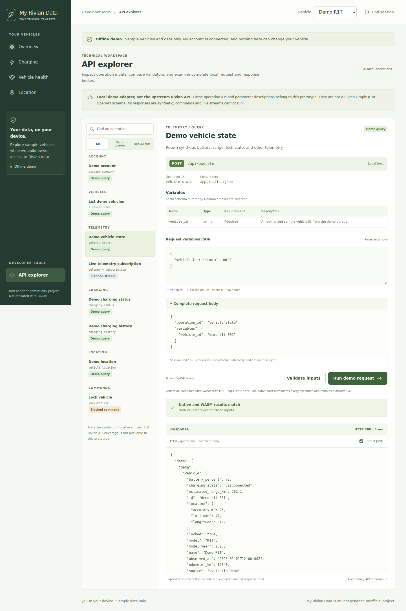
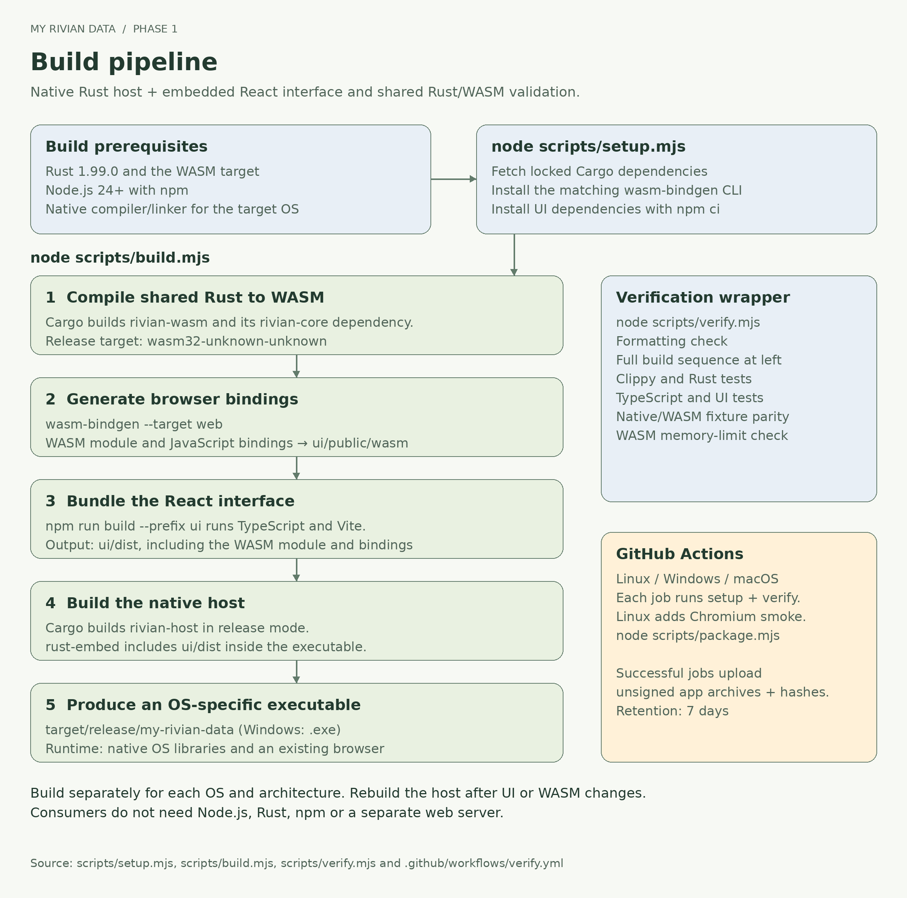

# Developer guide

[Owner guide](OWNER-GUIDE.md) · [Project overview](../README.md) · [Architecture and data flow](ARCHITECTURE.md)

My Rivian Data has two presentations of the same offline data: owner views grouped
by purpose, and a separate **API explorer** under Developer tools. Both use the same bounded
validation and native execution path. This is milestone 0, not a live Rivian client.

## Local API explorer

Open **API explorer** under **Developer tools** in the application navigation. The Swagger-like explorer
provides a grouped, searchable catalog, operation descriptions, editable JSON
variables, a local HTTP method and endpoint, request JSON, validation details,
and raw response JSON with HTTP status and elapsed time. Select an available demo
query, review its variables, and choose **Run demo request** to inspect a synthetic
response. **Validate inputs** checks inputs without executing the query.
The **Format JSON** checkbox switches between formatted JSON and the raw response
body; **Reset example** restores the operation's sample variables. Switching to an owner
view restores the plain-language presentation of the selected vehicle.

This is an explorer for the application's **local adapter API**. It is not Swagger
UI, an OpenAPI specification, a complete Rivian operation inventory, or a verified
Rivian GraphQL schema. Catalog IDs such as `charging-history` name local operations.
Every execution goes through `POST /api/execute`; the request body contains an
`operation_id` and `variables`:

```json
{
  "operation_id": "charging-history",
  "variables": { "vehicle_id": "demo-r1t-001", "limit": 10 }
}
```

The shared validator first checks the variables in WASM, then compares its result
with `POST /api/validate`. The host revalidates at execution and requires a valid
local session and CSRF token. The explorer does not display authentication secrets
or turn an arbitrary endpoint into a proxy. Planned subscriptions and blocked
commands remain unavailable in either presentation.



See the [local HTTP contract](ARCHITECTURE.md#local-http-contract),
[view-to-operation mapping](ARCHITECTURE.md#presentation-and-data-mapping), and
[session/data-flow diagram](ARCHITECTURE.md#session-sequence) for implementation
details.

## Build from source

Install [Rust through rustup](https://rustup.rs/) and [Node.js 24 or newer with npm](https://nodejs.org/). Rust is pinned to 1.99.0, with rustfmt, clippy and the `wasm32-unknown-unknown` target in `rust-toolchain.toml`.

- **Windows:** use the MSVC Rust toolchain and Visual Studio Build Tools with the C++ desktop workload and Windows SDK. PowerShell works for the commands below.
- **macOS:** install Xcode Command Line Tools (`xcode-select --install`).
- **Linux:** install the distribution's native C/C++ compiler and linker (for example, the `build-essential` package on Ubuntu/Debian).

From the project directory, run these same commands on each desktop OS:

```text
node scripts/setup.mjs
node scripts/build.mjs
node scripts/verify.mjs
```

Setup downloads Cargo dependencies, installs the exact `wasm-bindgen-cli` version recorded in `Cargo.lock` when necessary, and runs `npm ci` against the UI lockfile. It needs internet access and can take several minutes on a fresh machine. Build and verification use the locked dependencies; tools and dependencies still need to be downloaded before an air-gapped build.

The build compiles Rust to WASM, generates its web bindings, bundles the React interface, and then embeds that bundle in the native release binary. The executable appears at `target/release/my-rivian-data` or `target/release/my-rivian-data.exe`. Build after every UI or WASM change so the embedded assets stay current. Build separately on each target operating system/architecture; a Linux executable is not a Windows or macOS package.



The scripts invoke npm's JavaScript entry point through Node without a shell. If an unusual Node installation prevents discovery, set `RIVIAN_NPM_CLI` to the absolute path of its `npm-cli.js`. Cargo's default `target` directory is assumed by the build scripts; do not override `CARGO_TARGET_DIR` for this prototype.

## Verify

`node scripts/verify.mjs` runs formatting checks, the release build, clippy with warnings rejected, workspace tests, TypeScript checking, UI unit tests and native/WASM parity. The parity check runs the **compiled WASM** in Node, compares every checked-in fixture and the catalog with native Rust output, and checks that a 64 MiB memory ceiling is enforced. It can also run alone after a build:

```text
node scripts/check-parity.mjs
```

For the real-browser smoke test, install Chromium once and run the UI test script after building the host:

```text
node ui/node_modules/playwright/cli.js install chromium
npm run test:browser --prefix ui
```

On Linux, Playwright may also require distribution packages; `node ui/node_modules/playwright/cli.js install --with-deps chromium` installs those when run with suitable system privileges. The test can use an existing compatible Chromium by setting `PLAYWRIGHT_CHROMIUM_EXECUTABLE` to its executable path. Browser downloads are development/test dependencies, separate from the self-contained application.

The GitHub Actions workflow is configured to run the core checks on Linux, Windows and macOS, run the Chromium smoke test on Linux, and retain unsigned executable artifacts. Configuration is not evidence that those CI jobs have run. Actual results, browser checks, limitations and remaining work belong in [Implementation status](STATUS.md).

## Project layout

| Path | Responsibility |
| --- | --- |
| `crates/rivian-core` | Portable catalog, bounded input validation and synthetic data |
| `crates/rivian-wasm` | Non-secret WASM exports of the shared core |
| `crates/rivian-host` | Axum loopback service, local session boundary and embedded assets |
| `ui` | React/TypeScript interface and native-host HTTP adapter |
| `fixtures` | Synthetic fixtures consumed by native/WASM verification |
| `scripts` | Portable dependency setup, build and verification |
| `docs` | Implementation status and review evidence |

## Security and next milestones

The local host checks Host/Origin, uses a single-use bootstrap capability and session/CSRF protections, and exposes a bounded operation catalog. WASM linear memory is capped at 64 MiB; this does not cap the browser's total memory. The module does not export credential storage, networking, signing or command execution. These controls reduce specific attack paths; an offline prototype is not evidence of production security. See the [security review](SECURITY-REVIEW.md) and [implementation status](STATUS.md) for the tested boundary and outstanding findings.

Next milestones are a native credential-vault interface and authentication state machine, owner-authorized live read-only API validation, catalog expansion, reviewed command authority, packaging and independent adversarial review. Actual credential entry and live vehicle operations require those implementations and their gates; the demo UI must never solicit account passwords.

This original project code uses the repository's [GNU GPLv3 license](../LICENSE) (`GPL-3.0-only`). Third-party dependencies retain their own licenses and [notices](THIRD-PARTY-NOTICES.md). No assertion of a completed independent Anthropic review, live Rivian compatibility, signed release or store acceptance is made by this prototype.

## Launcher options

```text
my-rivian-data --help
my-rivian-data --port 43127
my-rivian-data --no-open --print-launch-url
```

`--port 0` chooses a free port (the default). `--no-open` suppresses browser launch.
`--print-launch-url` explicitly prints a sensitive, single-use bootstrap link that
expires after five minutes; open it locally and keep it out of screenshots, tickets
and shared logs. Restart the application to obtain a new link. The normal status
URL alone does not authorize a browser session.

## Technical documentation

- [Architecture, design boundaries, local API and data flow](ARCHITECTURE.md)
- [Security review and findings](SECURITY-REVIEW.md)
- [Implementation status and validation evidence](STATUS.md)
- [Standalone PNG diagrams and editable sources](diagrams/README.md)
- [Third-party licenses and notices](THIRD-PARTY-NOTICES.md)
