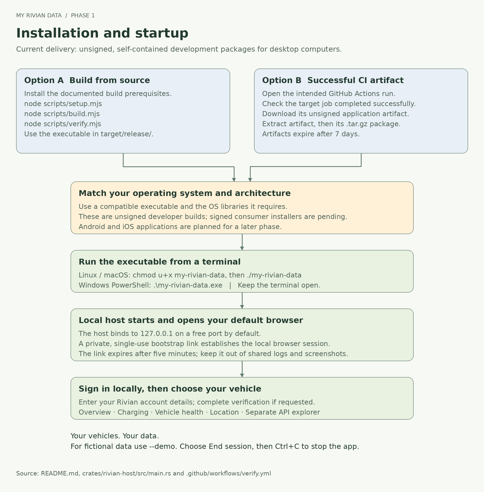
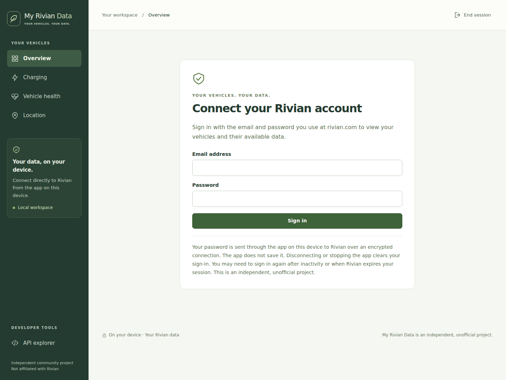
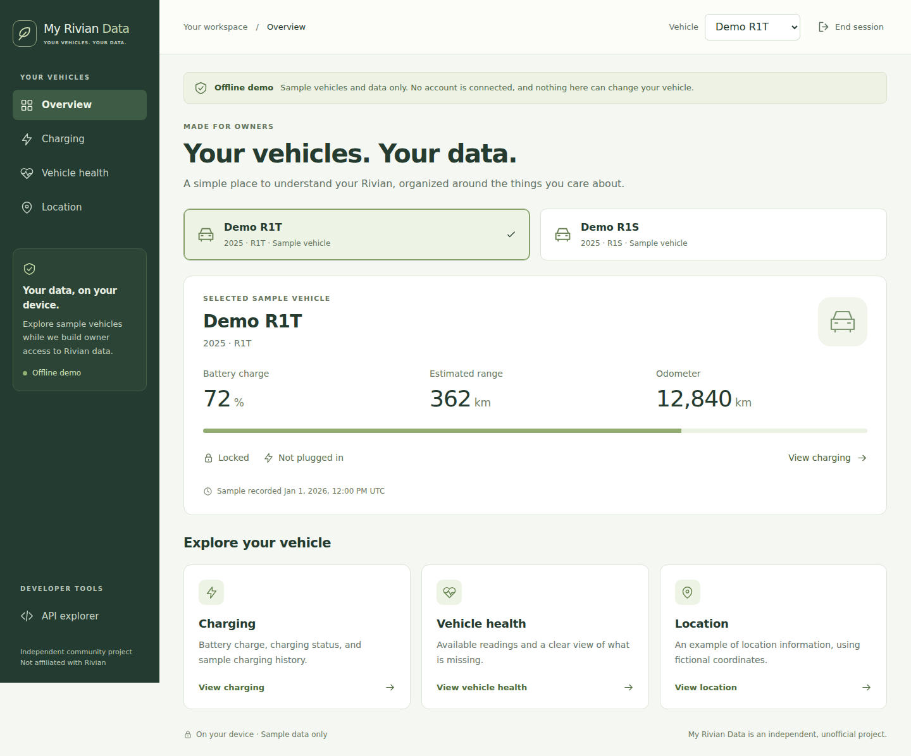
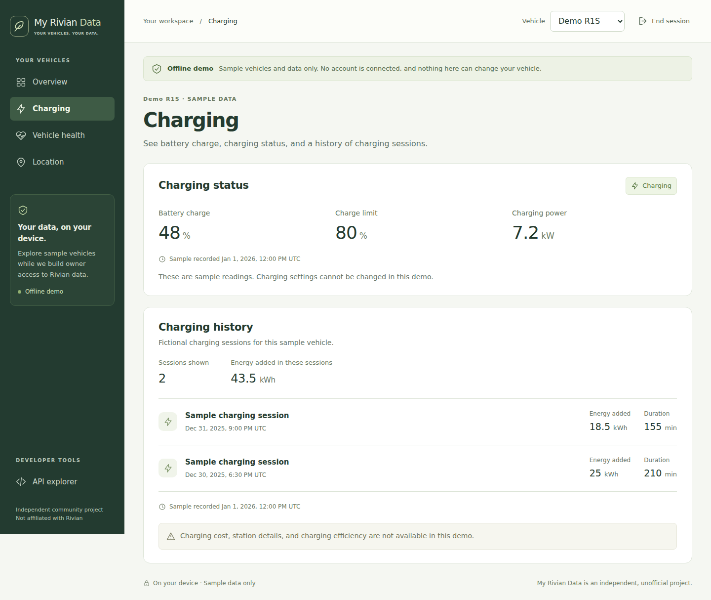

# Owner guide

[Project overview](../README.md) · [Developer guide](DEVELOPER-GUIDE.md)

**Your vehicles. Your data.** My Rivian Data runs on your computer and requests
available information directly from Rivian. The owner interface groups that
information around everyday questions. A separate developer view is available
for people who want to inspect individual requests.

The current live implementation is a development build. It has not yet been
checked with an owner's real account; see [implementation status](STATUS.md).
The API is unofficial and its availability may change.

## Get started

1. Obtain the package matching your desktop operating system and architecture
   from a successful [GitHub Actions job](https://github.com/asanderson/my-rivian-data/actions).
   Extract the downloaded artifact and then the `.tar.gz` package within it.
   `START-HERE.txt` is included in the extracted app folder.
   Developers can also [build from source](DEVELOPER-GUIDE.md#build-from-source).
2. Open a terminal in that folder. On Linux/macOS, run
   `chmod u+x my-rivian-data` if necessary, then `./my-rivian-data`.
   In Windows PowerShell, run `.\my-rivian-data.exe`.
3. The app opens your default browser. Keep the terminal open while using it.
   A built app does not require Rust, Node.js or a separate web server.
4. Sign in on this local page with your Rivian email address and password. If
   Rivian asks for an additional verification code, enter it in the app.

These are unsigned development packages. Each is specific to its operating
system and architecture; Linux packages cannot run on Windows or macOS. Signed
installers and Android/iOS applications are not yet available. A mobile-width
browser layout is not a released phone application.

## Sign-in and privacy

The local app forwards the entered sign-in details to Rivian over an encrypted
connection. Your password is used for sign-in and is not saved. Rivian session
tokens are held in the running native app's memory. The app does not write them
to a file, browser storage or an OS credential vault. There is no “remember me”
option; starting a new app session requires sign-in again.

The browser retains a separate, temporary local-app capability in this tab's
session storage so reloading the page can reconnect to the running app. It is
not a Rivian token. Ending the local session removes it. Browser session restore
behavior varies, so choose **End session** when you have finished.

Do not put your password, verification code or private launch link into a chat,
screenshot or support issue. The developer explorer can display personal vehicle
information: inspect a response before sharing it.

## Choose a vehicle

After sign-in, use **Vehicle** to choose a vehicle returned for your account. The
selection carries across **Overview**, **Charging**, **Vehicle health** and
**Location**. The native app checks that a requested vehicle belongs to the
signed-in account before making a vehicle request.

Owner views fetch information when opened or retried. They are snapshots, not a
continuous tracking service. A successful request does not mean the vehicle
reported every field at that instant; missing values and reporting times remain
visible rather than being replaced with plausible numbers.

## Overview

Start here for battery level, estimated driving range, charging state and lock
status. The lock reading covers the four passenger doors; it does not certify
that the frunk, tailgate or every opening is secure. Data depends on what Rivian reports for the selected vehicle. Unavailable
values do not mean a vehicle fault, zero range or an unlocked vehicle.

## Charging

See the reported charging state, battery level, configured charge limit and power
when available. Charging history lists the sessions returned by the API, with the
energy and duration fields it supplies. It is not guaranteed to contain every
home or public charging session. This app does not collect its own history in the
background or calculate billing totals from missing pricing data.

The charge limit is a readout. This build does not start or stop charging or change
vehicle settings.

## Vehicle health

This view contains available mileage, temperature and lock readings. It does not
diagnose the vehicle or infer a health score. **Battery health, tire pressure and
service history are not available in these owner cards.** Battery charge is the
amount of stored energy, not a measure of battery degradation. An unspecified
temperature sensor is not labeled as a particular component or cabin temperature.

## Location

See reported latitude and longitude, with accuracy and a reporting time when
available. There is no map, route history or background tracking. The app does
not load a third-party map service or forward the coordinates to one.

## End a session

Choose **Disconnect account** to discard the current Rivian account connection
while keeping the local app open for another sign-in.

Choose **End session** to revoke local access and discard the native account
session. Press Ctrl+C in the terminal to stop the app. Run it again to start a new
session. Reloading an active tab opens **Overview** again; view selection is not
saved. Closing the browser alone is not the same as stopping the app.

Logout attempts Rivian's logout request when a remote session is available. Local
access is removed even if the network is unavailable; the app cannot guarantee
remote revocation when Rivian cannot be reached.

## Try the demo

Run `./my-rivian-data --demo`, or `.\my-rivian-data.exe --demo` in PowerShell, to
explore without an account. It uses **Demo R1T** and **Demo R1S**, with fictional
locations and fixed sample timestamps. It never asks for Rivian credentials or
contacts Rivian. Reopening a view reads the same fixed examples.

These screenshots show sample mode, not verified live-account readings:

## Help

| What you see | What to do |
| --- | --- |
| Browser did not open | Keep the app running and see the [manual launch option](DEVELOPER-GUIDE.md#launcher-options). Keep the private one-use link to yourself. |
| Session ended or expired | Stop the executable and run it again. Sign in on the new local page. |
| Sign-in or verification fails | Check your account details and code, then follow the error shown. If Rivian requires an unsupported challenge, use the official app to resolve it. Repeated automated attempts will not bypass it. |
| Requests are limited or temporarily unavailable | Wait before trying again. The app does not continuously retry rejected requests. |
| A vehicle or value is missing | Check the account and selected vehicle. Available fields vary; missing readings remain unavailable. |
| Values never change in demo mode | Expected: demo readings and timestamps are fixed examples. |
| Package will not start | Check the operating system and architecture, extract all files, and see [validation limits](STATUS.md). Do not disable OS security checks blindly. |

## For developers

Open **API explorer** under **Developer tools** for admitted operations, editable
variables and JSON request/response details. Owner features do not require this
view. The [developer guide](DEVELOPER-GUIDE.md) covers the adapter contract,
architecture, data flow, build, packaging and security boundaries.
