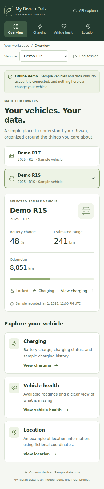

# Owner guide

[Project overview](../README.md) · [Developer guide](DEVELOPER-GUIDE.md)

**Your vehicles. Your data.** My Rivian Data is being built to make the information
associated with your Rivian vehicles easy to understand and use.

The current version is an **offline demo**. It uses fictional vehicles, fixed sample
timestamps and sample readings. There is no Rivian sign-in, account connection or
vehicle control. You can explore the interface without entering any credentials.

## Get started

1. Obtain a development executable for your operating system and architecture.
   Successful [GitHub Actions jobs](https://github.com/asanderson/my-rivian-data/actions)
   provide unsigned executable artifacts. Extract the downloaded archive first.
   If you are building it yourself, follow the [developer setup](DEVELOPER-GUIDE.md#build-from-source).
2. Open a terminal in the folder containing the executable. On Linux/macOS,
   run `chmod u+x my-rivian-data` if needed, then `./my-rivian-data`.
   In Windows PowerShell, run `.\my-rivian-data.exe`.
3. The app opens your default browser. Leave the terminal open while you explore.
   You do not need Rust, Node.js or a separate web server to run a built executable.

These are unsigned development builds, not signed consumer installers. Check the
[implementation status](STATUS.md) for tested platforms and current limitations.
Desktop executables are specific to their operating system and architecture;
an executable built for Linux will not run on Windows or macOS. Android and iOS
applications are planned for a later phase. The mobile-width screenshot below shows
a responsive browser layout, not a released phone application.

## Choose a vehicle

Use **Vehicle** to choose **Demo R1T** or **Demo R1S**. The selected vehicle carries
across the owner views. Both vehicles are fictional, including their locations.
Switching vehicles lets you compare how the interface presents different sample
battery levels, ranges and charging states.

The navigation groups information by purpose: **Overview**, **Charging**,
**Vehicle health** and **Location**. Each view labels its values as sample data.
Reopening a view reads the same fixed examples; it does not contact Rivian
or make the timestamps current.

## Overview

Start here for a quick look at battery level, estimated driving range, charging
state and lock status. These are sample readings for the selected vehicle. Follow
the navigation to explore charging, health or location in more detail.

## Charging

See the selected vehicle's sample charging state, battery level, charge limit and
charging power. A disconnected vehicle has no active charging power in this demo.
The displayed charge limit is an example setting; the app cannot change it.

The charging history lists fictional sessions with a start time, energy added
(in kWh) and duration. It demonstrates how history will be presented; it is not a
record of your vehicle's charging. Pricing, payments, a complete charging history
and ongoing collection are not available.

## Vehicle health

This view currently contains the odometer distance, reported temperature and lock status.
The sample does not identify which sensor supplied the temperature. It does not
diagnose your vehicle. **Battery health, tire pressure and service history are
unavailable**, and the interface identifies those gaps rather than inventing
readings. Battery charge percentage describes stored energy, not battery health.
Lock status is a readout; there is no lock or unlock control.

## Location

See fictional latitude and longitude, sample accuracy and the fixed sample time.
There is no map, route history or live tracking. The app does not load a map service
or send these sample coordinates to one.

## End a session

Choose **End session** to close access to the current demo session. Press Ctrl+C in
the terminal to stop the app. Run the executable again to begin a new session.
Reloading an active session opens **Overview** again; navigation is not saved.
The app does not store Rivian credentials or vehicle history in the browser.

## Help

| What you see | What to do |
| --- | --- |
| The browser did not open | Keep the terminal open and see the [manual launch option](DEVELOPER-GUIDE.md#launcher-options). Its private, one-use link should not be shared. |
| The session ended or expired | Stop the executable and run it again to open a new session. |
| The values do not change after reopening a view | That is expected: the demo uses fixed sample data. |
| A feature is unavailable | Check [current limitations and planned work](STATUS.md). Login, live data and vehicle commands have not been implemented. |

## For developers

Under **Developer tools**, open **API explorer** to inspect local API operations,
request variables and raw requests/responses. You do not need this view for the
owner features. It exposes the demo's local interface and keeps live commands
unavailable. See the [developer guide](DEVELOPER-GUIDE.md) for the explorer, build
instructions, architecture, data flow and security notes.
